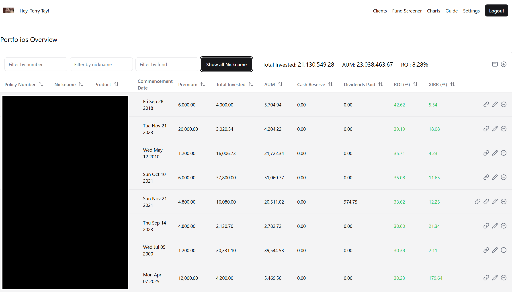

# XXX — Internal Insurance Analytics Ecosystem

> **Note:** Internal tools built for my company. The code is provided for demonstration and recruitment purposes only — not for public reuse.

## 📌 Overview

XXX is a **full-stack insurance analytics platform** I designed and developed to help insurance agents work faster and smarter.  
It automates the retrieval, parsing, and analysis of insurance data — especially investment-linked policies (ILPs) — and presents agents with **clear, actionable insights**.

This ecosystem consists of:

1. **XXX Web Platform** — a secure, responsive dashboard for analytics and decision-making
2. **XXX Chrome Extension** — a browser tool for extracting and importing data directly from financial systems into the platform

---

## 🖼️ Screenshots

| Overview                            | Analysis                            | Insights                            |
| ----------------------------------- | ----------------------------------- | ----------------------------------- |
|  |  |  |

---

## 🔹 Key Highlights

- **Automated Data Retrieval & Processing**

  - Headless browser automation + custom parsing scripts
  - Chrome Extension to extract structured data from industry financial systems with a single click

- **ILP Performance Analytics**

  - Historical performance trends
  - Volatility analysis
  - Product suitability scoring

- **Decoupled Secure Architecture**

  - **Supabase** for meta-information, configuration, and logs
  - **MongoDB** for sensitive ILP transaction data
  - Designed for **data isolation** to prevent cross-leakage

- **Agent-Centric Workflow**

  - Minimises manual lookup
  - Highlights key performance and risk metrics instantly
  - Streamlined for client meeting preparation

- **Actionable Visualisations**
  - Portfolio breakdowns
  - Side-by-side policy comparisons
  - KPI dashboards for informed decision-making

---

## 🛠️ Tech Stack

**Frontend:** Next.js (App Router), Tailwind CSS  
**Backend:** Node.js (API routes in Next.js)  
**Databases:**

- Supabase (PostgreSQL) — meta data, authentication, access control
- MongoDB — ILP transactions and customer financial data  
  **Automation & Integration:**
- Headless browser automation
- Chrome Extension for in-system data extraction  
  **Deployment:** Vercel (internal access)

---

## 📈 Impact

- Reduced **policy analysis time** from ~20 minutes to **under 1 minute**
- Enabled **direct in-system data capture** via Chrome Extension
- Improved **recommendation accuracy** through automated performance analysis
- Enhanced **data security** via separation of concerns and role-based access

---

## 👨‍💻 About the Developer

I’m a software engineer with deep experience in **finance, insurance, and trading**.  
This project demonstrates my ability to:

- Architect secure, scalable solutions
- Build **full-stack web platforms** and **browser extensions**
- Integrate data pipelines with **real-world business systems**
- Deliver measurable operational impact

---

If you’re a recruiter or hiring manager interested in **full-stack, data-driven applications** that solve real business problems, let’s talk.
